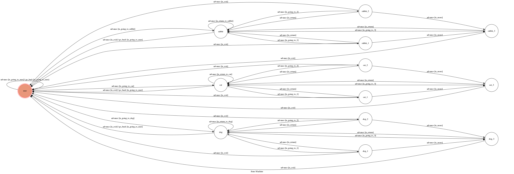

# TOC Project

A telegram bot based on a finite state machine

## What can the bot do
You can enter the name of the animal and the bot will find pictures for you. Also, it will provide you some other information.

## Usage
The initial state is set to `user`.
Enter the message by the instructions.

* user
	* Input: "rabbit"
		* Reply: "You choose rabbit!" and go to `rabbit` state

	* Input: "cat"
		* Reply: "You choose cat" and go to `cat` state

	* Input: "dog"
		* Reply: "You choose dog" and go to `dog` state
* rabbit/cat/dog
	* Input: "A" or "B" or "C"
		* Show the link of the website and go to the corresponding state

	* Input: "E"
		* Return to the `user` state

* rabbit1/rabbit2/cat1/cat2/dog1/dog2
	* Input: "R"
		*Return to `rabbit`/`cat`/`dog`

	* Input: "M"
		*Go to `rabbit3`/`cat3`/`dog3`

	* Input: "E"
		*Go back to `user` state
* rabbit3/cat3/dog3
	* Input: "R"
		*Return to `rabbit`/`cat`/`dog`

	* Input: "E"
		*Return to `user` state

## Finite State Machine

